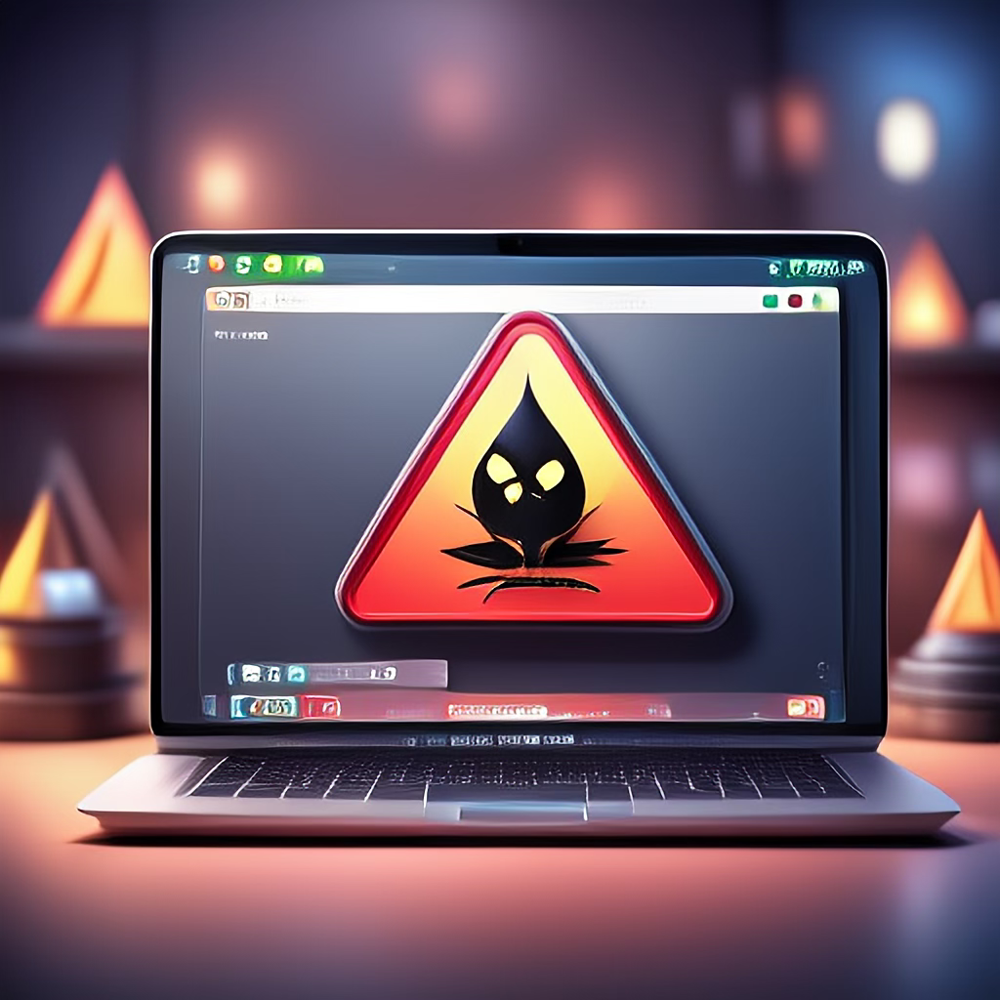

  

# Damn Vulnerable macOS Application (DVMA)
Damn Vulnerable macOS Application (DVMA) is a purposefully designed macOS application that is riddled with security vulnerabilities. Its primary goal is to provide macOS enthusiasts, developers, and security researchers with a safe and controlled environment to learn, practice, and understand macOS application security.

DVMA is an educational tool that offers hands-on experience in identifying and exploiting various vulnerabilities. It is ideal for those looking to sharpen their skills in areas such as reverse engineering, malware analysis, and penetration testing, all within the unique ecosystem of macOS.

## Key Features:

* Simulated Vulnerabilities: Learn about and exploit common security flaws in macOS applications, including insecure data storage, improper code signing, weak encryption, and more.
* Educational Focus: This course is designed for learners at all levels, from beginners exploring macOS internals to seasoned professionals honing their expertise.
* Safe Environment: Provides a controlled setting to explore and experiment with vulnerabilities without impacting real-world systems.
* Hands-On Practice: Encourages practical application of security concepts, fostering a deeper understanding of macOS-specific challenges and best practices.

## Installing DVMA
* Download the DVMA.dmg file.
* Double-click the DVMA.dmg file to open it.
* Copy the DVMA.app file to the Applications folder.
* Launch DVMA from the Application Launchpad.

<video width="320" height="240" controls>
  <source src="Installation.mp4" type="video/mp4">
  Your browser does not support the video tag.
</video

## Vulnerabilities Included:

1. Excessive Permissions Granted
2. Minimum OS Version Low
3. Hardcoded API Keys
4. Insecure SIP Detection
5. Sensitive Information stored in Memory
6. Insecure Data Leakage in Logs
7. Insecure Data Storage in Keychain
8. Insecure Firebase Database
9. Insecure Local Data Storage in plist files
10. Insecure WebView Attacks
11. SQL Injection Attack
12. Command Injection Attack
13. Insecure SSL Pinning
14. Insecure TouchID Implementation
15. Network Layer Security

## Who is it For?

* Security Enthusiasts: Individuals interested in exploring macOS application vulnerabilities.
* Developers: Those looking to understand how to secure their macOS applications against potential attacks.
* Researchers: Professionals investigating macOS security mechanisms and bypass techniques.
* Students: Learners seeking a hands-on introduction to macOS application security.

## Disclaimer
DVMA is intended solely for educational purposes. You can use this application in a secure and isolated environment. The developers and contributors are not responsible for any misuse or harm caused by the application. When working with security tools and concepts, abide by ethical guidelines and legal frameworks.

This app is created solely by Vaibhav Lakhani and is not affiliated with, endorsed by, or representative of any company. Any views, opinions, or content expressed within the app are those of the individual creator and do not reflect the views or opinions of Kroll.
